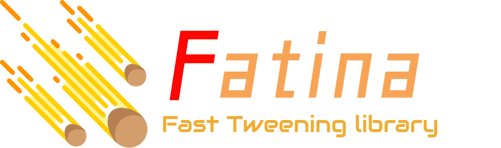

# Fatina

Lighweight Tweening Library for Games / Web

## Fatina Next ?

This repo is a reboot of [**Fatina**](https://github.com/kefniark/Fatina), The main idea is to make it simpler and more future proof.

The original project is more than 5 year old and a small cleanup seems necessary.

### Goals
- ESM build & Tree shaking
    - No more `Fatina` object
    - Even smaller in user project
- Better and simpler API (Composition API)
    - No more plugins system (can be composited)
    - No more `start()`
    - Fully typed (less error prone)
    - By default accept nested properties
    - Auto resolve animation conflicts
    - Every tween is a sequence by default
- Better and faster tooling
    - Mono Repo
    - Brand new docs with vuepress

When good enough, it will probably be merged back in the main repo and become fatina@v4.x

### API Idea

```ts
// single animation 1s
animate(obj).to({ x: 2 }, 1000)

// sequence of 3s
animate(obj)
  .to({ x: 200 }, 1000)
  .to({ x: 400 }, 1000)
  .to({ x: 600 }, 1000)

// nested
animate(obj).to({ "position.x": 200, opacity: 1 }, 1000)

// simpler events
animate(obj)
    .on(() => console.log('Started'))
    .to({ "position.x": 200, opacity: 1 }, 1000)
    .on(() => console.log('Completed'))

// async
await animate(obj).to({ x: 2 }, 1000).async()
```